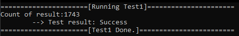
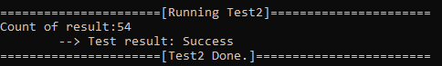
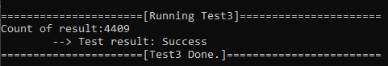
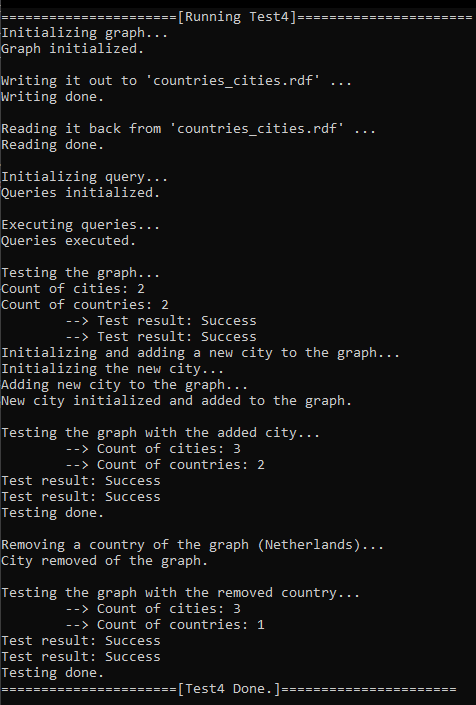

# Manuális tesztek dokumentációja

## Tesztek

## Teszt #1

Bemenet: 'szepmuveszeti.rdf' file

Elvárt kimenet: 1743 darab actor (művész)

Lépések:

<ol>
    <li>Gráf beolvasása a "szepmuveszeti.rdf" fileból.</li>
    <li>Query inicializálása az összes actor (művész) lekérdezésére.</li>
    <li>Query lefuttatása.</li>
    <li>Eredmény összehasonlítása az elvárt eredménnyel.</li>
    <li>Eredmény kiírása a standard kimenetre.</li>
</ol>

Standard kimenet:

## Teszt #2

Bemenet: 'szepmuveszeti.rdf' file

Elvárt kimenet: 54 darab actor (művész)

Lépések:

<ol>
    <li>Gráf beolvasása a "szepmuveszeti.rdf" fileból.</li>
    <li>Query inicializálása "Giovanni" nevű actorok (művész) lekérdezésére (akiknek a nevében szerepel a "Giovanni" string).</li>
    <li>Query lefuttatása.</li>
    <li>Eredmény összehasonlítása az elvárt eredménnyel.</li>
    <li>Eredmény kiírása a standard kimenetre.</li>
</ol>

Standard kimenet:

## Teszt #3

Bemenet: 'szepmuveszeti.rdf' file

Elvárt kimenet: 4409 darab <u>hármas</u> arról, hogy melyik művészhez milyen alkotás tartozik.

Lépések:

<ol>
    <li>Gráf beolvasása a "szepmuveszeti.rdf" fileból.</li>
    <li>Query inicializálása egy olyan lekérdezésre, amiben a művészeket összekapcsoljuk az alkotásaikkal az alkotási folyamaton keresztül.</li>
    <li>Query lefuttatása.</li>
    <li>Eredmény összehasonlítása az elvárt eredménnyel.</li>
    <li>Eredmény kiírása a standard kimenetre.</li>
</ol>

Standard kimenet:

## Teszt #4

Bemenet: Nincsen explicit bemenet.

Elvárt kimenet:

-   Az eredeti állapotban 2 darab ország, 2 darab város.
-   Új város hozzáadása után 2 darab ország, 3 darab város.
-   Egy ország törlése után 1 darab ország, 3 darab város.

Lépések:

<ol>
    <li>Felépíteni memóriában egy egyszerű RDF gráfot országok és azok fővárosairól kettő darab példa várossal és kettő darab példa országgal, és azok kapcsolataival.</li>
    <li>Gráf kiírása egy külső fileba.</li>
    <li>Gráf visszaolvsasása a memória a létrehozott külső fileból.</li>
    <li>A teszteléshez használt kettő darab query inicializálása a városok és az országok lekérdezésére.</li>
    <li>A queryben visszaadott országok és városok számának összehasonlítása az elvárt eredménnyel.</li>
    <li>Eredmény kiírása a standard kimenetre.</li>
    <li>Egy város hozzáadása a memóriába tárolt gráfhoz.</li>
    <li>Query újra futtatása, az országok és városok számának összehasonlítása az elvárt eredménnyel.</li>
    <li>Eredmény kiírása a standard kimenetre.</li>
    <li>Egy ország törlése a memóriában tárolt gráfból.</li>
    <li>Query újra futtatása, az országok és városok számának összehasonlítása az elvárt eredménnyel.</li>
    <li>Eredmény kiírása a standard kimenetre.</li>
</ol>

Standard kimenet:

